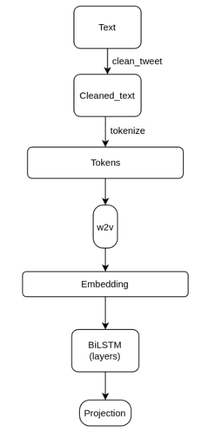
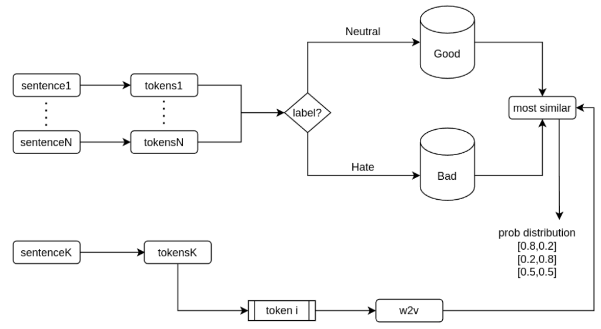

# sentiment_analysis_ita

# Hate Speech Detection with BiLSTM and Word2Vec

This project involves binary classification of tweets to determine whether they are hate speech or neutral. The best performing model combines a BiLSTM with a Word2Vec model.

## Table of Contents
- [Introduction](#introduction)
- [Dataset](#dataset)
- [Preprocessing](#preprocessing)
- [Model Architecture and Design Choices](#model-architecture-and-design-choices)
- [Baselines](#baselines)
- [Results](#results)
- [How to Run the Code](#how-to-run-the-code)
- [License](#license)

## Introduction
The task is to classify tweets as either hate speech or neutral. Various approaches were tried, but the combination of a BiLSTM model with a Word2Vec embedding proved to be the most effective.

## Dataset
The dataset used is from the haspeede3 dataset. It is split into training and test sets, with the training set further divided into training and validation set, haspeede3-task1-test-data is the json from which load the test samples, while haspeede3-task1-train-data are the sample used for training the model.

## Preprocessing
1. Symbols like `@` and `#` were removed.
2. URLs indicated as `[URL]` were also removed.
3. Emojis and special characters were retained as their removal led to decreased model accuracy.

Different tokenizers were evaluated (spacy, nltk, stanza), and `nltk` was chosen for its speed.
Moreover the removal of the stopwords leads to a better performance for the model

## Model Architecture and Design Choices

The architecture starts with text cleaning and tokenization using `nltk`. The tokens are then embedded using a Word2Vec model trained on the training set. This is followed by passing the embeddings through a BiLSTM layer. An early stopping mechanism was implemented to save the best model based on validation accuracy.

**Model Parameters:**

| Parameter       | Value     |
|-----------------|-----------|
| vector size     | 100       |
| hidden dim      | 32        |
| dropout         | 0.4       |
| BiLSTM layers   | 4         |
| bidirectional   | True      |
| learning rate   | 1e-4      |
| optimizer       | AdamW     |

## Baselines
1. **Stratified Baseline**: Predicts labels based on the distribution of labels in the training set, achieving an accuracy of 0.55.

2. **Advanced Baseline**: Uses Word2Vec to classify if a token is in a neutral (good set) or in hate speech sample (bad set). More detail in report.pdf.

## Results
The BiLSTM model with Word2Vec embedding achieved better performance compared to the baselines:

| Model                | Accuracy | Precision |
|----------------------|----------|-----------|
| BiLSTM + Word2Vec    | 0.76     | 0.43      |
| Advanced Baseline    | 0.66     | 0.36      |
| Stratified Baseline  | 0.55     | 0.27      |

The model showed good accuracy but lower precision, likely due to class imbalance in the dataset.

## How to Run the Code
The code is designed to run on Google Colab. To execute, simply open the Colab notebook and press the "Run All" button.

## License
This project is licensed under the MIT License - see the LICENSE file for details.

